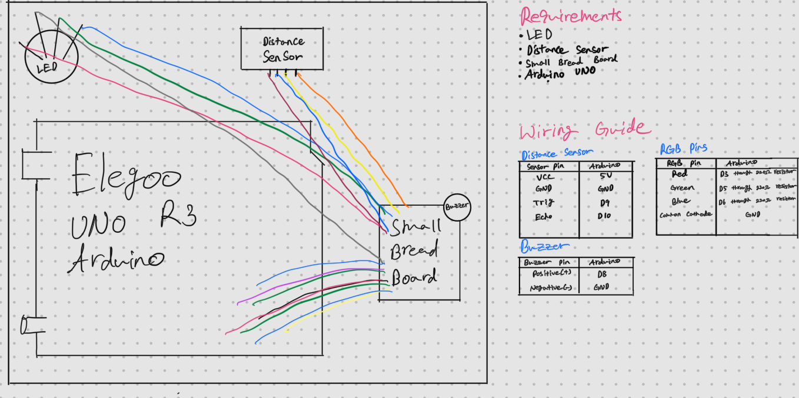
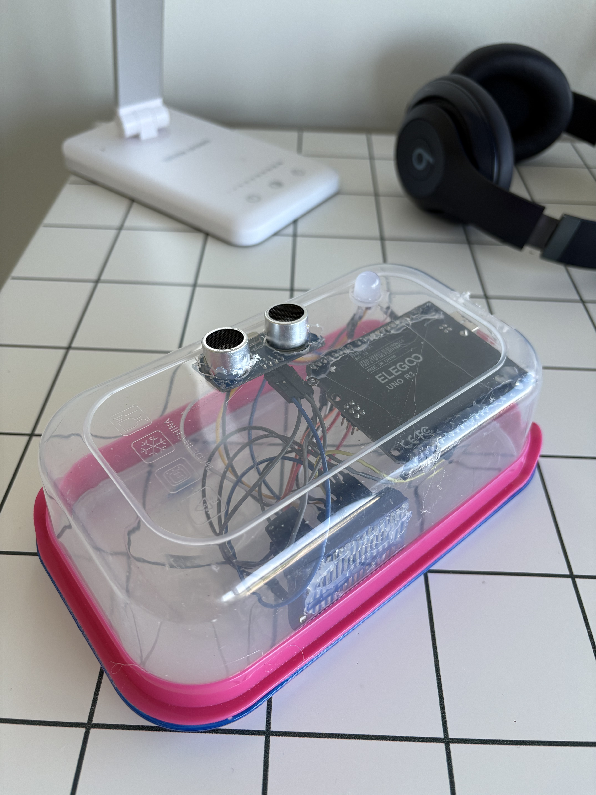
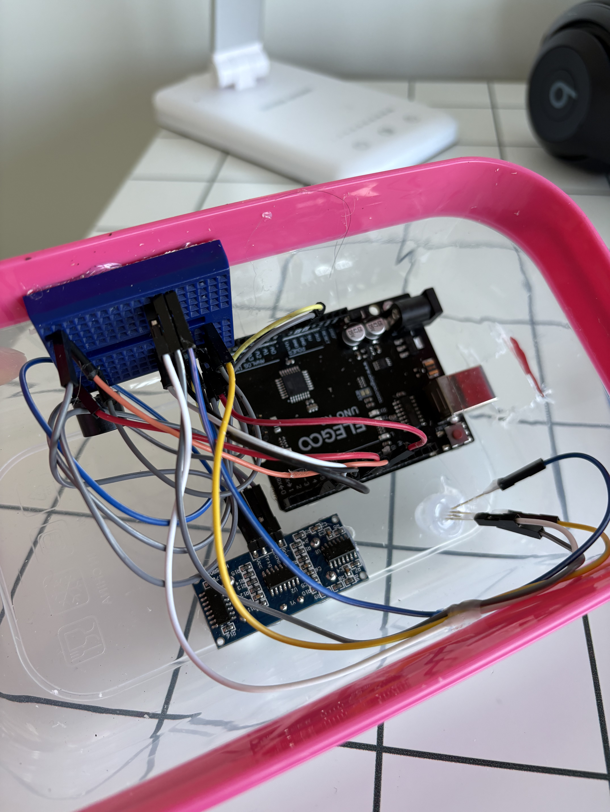

# Arduino Push-up Checker

> Push Up Checker with Arduino UNO

   

## 📋 Table of Contents

- [Features](#features)
- [Setup](#setup)
- [Usage](#usage)

## ℹ️ Project Information

- **👤 Author:** y3chnx
- **📄 License:** MIT
- **📂 Repository:** [https://github.com/y3chnx/arduino_pushup_checker](https://github.com/y3chnx/arduino_pushup_checker)

## Features

**This project checks whether your push-up is valid or not**
- If your push-up is valid, the buzzer rings and the light changes to green. 

## Setup

Make the hardware like those pictures, and upload [.ino](pushup_counting.ino) file using [Arduino Software](https://www.arduino.cc/en/software/)

## Usage

You can use this project like this:

